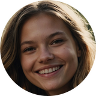
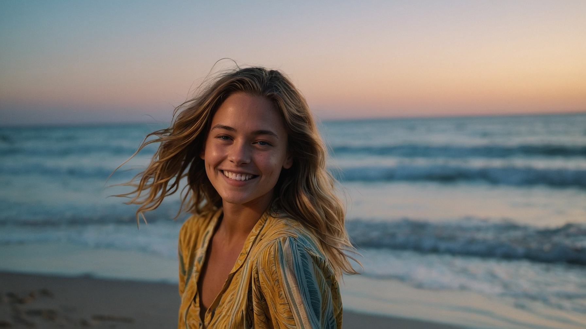
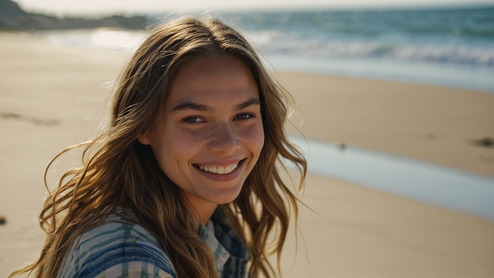
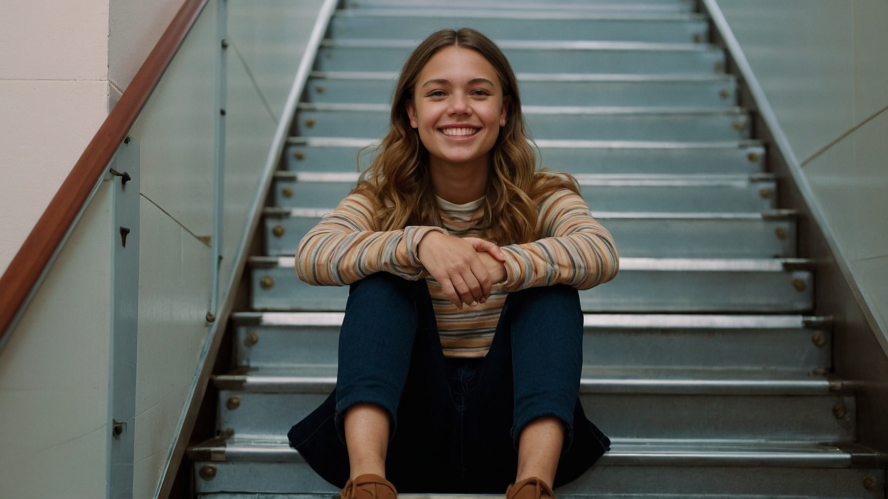
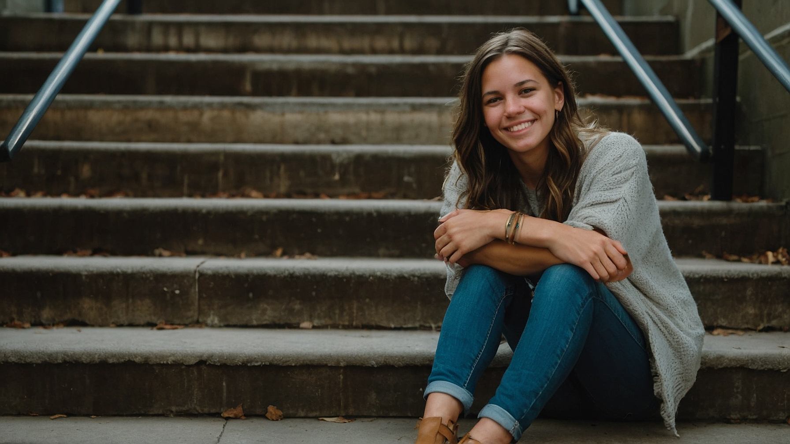
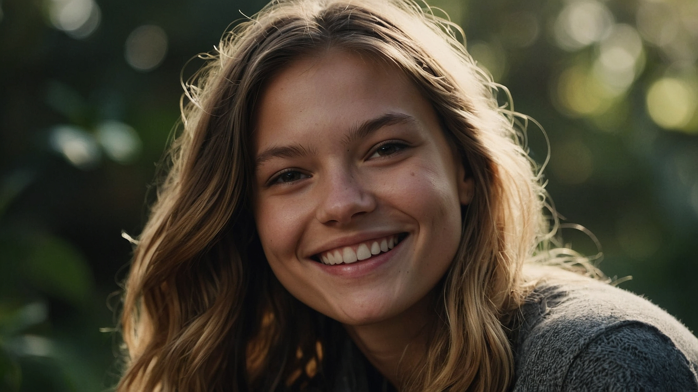
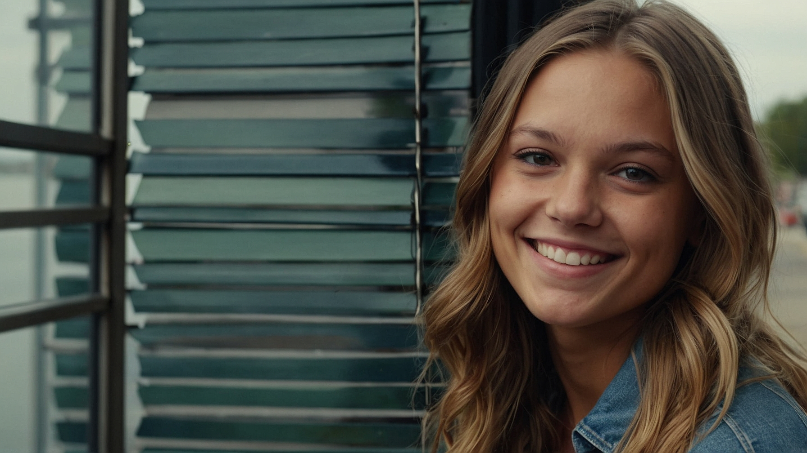

<a name="readme-top"></a>

<div align="center">
  
  [![Contributors][contributors-shield]][contributors-url]
  [![Forks][forks-shield]][forks-url]
  [![Stargazers][stars-shield]][stars-url]
  [![Issues][issues-shield]][issues-url]

</div>
<br />
<div align="center">
  <a href="https://github.com/voaneves/lab-natty-or-not">
    
  </a>
  <h3 align="center">lab-natty-or-not</h3>
  <p align="center">
    Criando uma influenciadora digital criada "natty", através de IA.
    <br />
    <a href="https://github.com/voaneves/lab-natty-or-not"><strong>Explore a documentação »</strong></a>
    <br />
    <br />
    <a href="https://github.com/voaneves/lab-natty-or-not/issues">Reporte um bug</a>
    ·
    <a href="https://github.com/voaneves/lab-natty-or-not/issues">Peça uma funcionalidade</a>
  </p>
</div>

<details>
  <summary>Índice</summary>
  <ol>
    <li>
      <a href="#sobre-o-projeto">Sobre o Projeto</a>
      <ul>
        <li><a href="#tecnologias-utilizadas">Tecnologias Utilizadas</a></li>
        <li><a href="#processo-de-criação">Processo de Criação</a></li>
      </ul>
    </li>
    <li><a href="#resultados">Resultados</a></li>
    <li><a href="#reflexão">Reflexão</a></li>
    <li><a href="#contribuindo">Contribuindo</a></li>
    <li><a href="#agradecimentos">Agradecimentos</a></li>
  </ol>
</details>

## Sobre o Projeto

"**lab-natty-or-not**" é uma **inovadora iniciativa** que une moda, tecnologia e inteligência artificial para criar **Kara Williams Strafford**, uma influenciadora digital que redefine a forma como interagimos com conteúdo de estilo. Fruto do **Bootcamp Nexa - Fundamentos de IA Generativa e Claude 3** da [DigitalInnovationOne (DIO)](https://www.linkedin.com/school/dio-makethechange/), este projeto explora **novas dimensões da expressão digital e influência** no mundo virtual.

O coração deste projeto está no desafio de criar algo "*natty*" — uma gíria para algo que parece tão real que é praticamente impossível discernir se foi criado por IA ou não. Este termo encapsula perfeitamente a essência de Kara, uma influência digital que **desafia as fronteiras entre o artificial e o autêntico**. À medida que a tecnologia avança, torna-se cada vez mais difícil distinguir criações de IA de realidades humanas, especialmente com o uso de tecnologias de ponta como **Dall-E** para geração visual, **Leonardo.AI** para modelagem comportamental e **Claude 3** para produção de conteúdo. Este projeto não apenas demonstra a habilidade de simular a realidade com **precisão impressionante**, mas também promove uma reflexão sobre o papel crescente da IA em campos criativos e suas implicações éticas.

Em um mundo onde a diferença entre o real e o artificial continua a esbater-se, "**lab-natty-or-not**" serve como um campo de teste para a próxima geração de influenciadores digitais, onde a linha entre humanos e máquinas está cada vez mais tênue. Este projeto é uma janela para o futuro da moda e do estilo, oferecendo uma nova forma de entender a interação humana com criações digitais e estabelecendo um novo padrão para o que consideramos **autenticamente natty**.

### Tecnologias Utilizadas

Utilizamos uma combinação de tecnologias avançadas:

- **Claude 3**: Geração do prompt e do nome da modelo.
- **Dall-E**: Para a criação visual de Kara.
- **Leonardo.AI**: Para replicar o visual em diversos imagens similares.

### Processo de Criação

O processo de criação de **Kara Williams Strafford** iniciou com a geração de um prompt descritivo usando **Claude 3**. Este prompt buscava descrever uma pessoa que emana uma vibração jovem, natural e autêntica, com características específicas para garantir uma representação visual única. O prompt gerado foi:

```
Imagem fotorealista de uma jovem sorridente, com cabelo castanho claro ondulado, olhos azuis e uma expressão amigável, num ambiente natural ao entardecer
```

Para o nome, **Claude 3** também foi utilizado para gerar uma combinação de nomes que soasse contemporânea, amigável e de fácil aceitação global. O nome escolhido, "**Kara Williams Strafford**", foi gerado a partir de um prompt que buscava um nome que combinasse uma sonoridade suave e moderna, fácil de lembrar e com apelo internacional, além de combinar com o prompt que inserimos em conjunto. Isto também é importante para replicar a face da modelo.

Esse prompt foi então alimentado ao **Dall-E**, que criou a imagem visual de Kara. Após a criação da imagem por Dall-E, **Leonardo.AI** foi empregado para expandir o portfólio visual de Kara, criando várias imagens em diferentes configurações e expressões, mas mantendo a consistência do estilo original. Isso permitiu que Kara tivesse uma presença online versátil e adaptável a diferentes contextos de moda e estilo.

Este meticuloso processo de combinação de IA gera não apenas uma figura pública digital, mas uma nova forma de interação e engajamento no espaço digital, explorando a interseção entre tecnologia, criatividade e identidade.

<p align="right">(<a href="#readme-top">back to top</a>)</p>

## Resultados

A **capacidade** do projeto "lab-natty-or-not" para gerar representações visuais realistas é demonstrada através das imagens criadas de Kara Williams Strafford. Com o uso das tecnologias **Dall-E** e **Leonardo.AI**, conseguimos produzir uma série de imagens consistentes que mostram Kara em variados cenários, de praias ao entardecer a espaços urbanos.

- 
- 
- 
- 
- 
- 

As imagens ilustram Kara em diferentes ambientes, mantendo características físicas coerentes, como cabelo castanho claro ondulado e olhos azuis. Esta consistência visual sustenta a identidade digital de Kara como influenciadora.

Essas imagens não foram publicadas online, mas sim criadas como parte de uma demonstração de nossa capacidade de gerar conteúdo digital visualmente consistente. O conjunto de imagens serve como uma prova de conceito para o uso de influenciadores digitais gerados por IA, explorando novas possibilidades para criação de conteúdo e interação digital.

A qualidade e consistência das imagens geradas refletem o uso eficaz de nossas tecnologias de IA e representam um passo significativo para futuras aplicações em ambientes digitais.

<p align="right">(<a href="#readme-top">back to top</a>)</p>

## Reflexão

O projeto "lab-natty-or-not" explora questões profundas sobre autenticidade e realidade num mundo crescentemente digitalizado. A expressão "*natty or not*", popularizada pelo YouTuber Rodrigo Goés de forma humorística no bodybuilding, se revela uma metáfora pertinente para nossa discussão sobre IA. No fitness, "natty" descreve alguém naturalmente musculoso, enquanto "fake natty" se refere àqueles que simulam essa condição. Esse paralelismo ilumina a tênue linha entre o genuíno e o artificial, um tema que ecoa no desenvolvimento de influenciadores digitais via IA.

Como Ray Kurzweil explora em "**The Age of Spiritual Machines**", a IA transforma nossas capacidades e identidades, sugerindo que "nos tornamos mais como máquinas à medida que integramos tecnologia" (Kurzweil, 1999). Paralelamente, em "**Weapons of Math Destruction**", Cathy O'Neil critica como algoritmos podem perpetuar desigualdades, alertando que "o impacto desses modelos excede nosso controle" (O'Neil, 2016). Essas perspectivas destacam a responsabilidade ética na criação de figuras públicas influentes através de IA.

Além disso, a pesquisa de MacInnis e Folkes (2017) no *Journal of Consumer Psychology* revela que consumidores frequentemente humanizam marcas, atribuindo-lhes características humanas. Esse fenômeno, similar à criação de influenciadores como Kara, pode intensificar o engajamento e influenciar comportamentos, levantando questões sobre dependência e manipulação (MacInnis & Folkes, 2017).

**Essa interseção entre tecnologia e ética exige uma reflexão crítica sobre o poder de criar realidades alternativas**. À medida que desenvolvemos IA capaz de simular e potencialmente substituir interações humanas, devemos avaliar as implicações amplas dessa tecnologia. Estamos caminhando para uma era onde o "fake natty" digital pode se tornar comum, obscurecendo as linhas entre real e artificial?

**Manter uma perspectiva crítica e ética é crucial enquanto avançamos, garantindo que a inovação tecnológica beneficie a sociedade, e não apenas simule experiências humanas**. Isso requer diálogo contínuo entre desenvolvedores, reguladores e o público, para construir um futuro ético para a IA em influência digital.

Considerando influenciadoras digitais como Emily Pellegrini, uma criação de IA que simula autenticidade no Instagram ([emilypellegrini](https://www.instagram.com/emilypellegrini/)), precisamos ponderar como essas inovações podem complementar ou desafiar dinâmicas humanas tradicionais. A "autenticidade" programada de Emily contrasta com a imperfeição humana, provocando um debate vital sobre o valor da genuinidade frente à perfeição fabricada, e o papel da tecnologia na definição de autenticidade nas relações sociais.

<p align="right">(<a href="#readme-top">back to top</a>)</p>

## Referências

- Kurzweil, R. (1999). *The Age of Spiritual Machines: When Computers Exceed Human Intelligence.* [[LINK]](https://www.amazon.com.br/Age-Spiritual-Machines-Ray-Kurzweil/dp/0140282025)
- O'Neil, C. (2016). *Weapons of Math Destruction: How Big Data Increases Inequality and Threatens Democracy.* [[LINK]](https://www.amazon.com/Weapons-Math-Destruction-Increases-Inequality/dp/0553418815)
- MacInnis, D. J., & Folkes, V. S. (2017). "Humanizing brands: When brands seem to be like me, part of me, and in a relationship with me." *Journal of Consumer Psychology* [[LINK]](https://www.sciencedirect.com/science/article/abs/pii/S1057740816301061)

<p align="right">(<a href="#readme-top">back to top</a>)</p>

## Agradecimentos

- Bootcamp Nexa e [DIO](https://www.linkedin.com/school/dio-makethechange/): Por fornecerem o ambiente e os recursos necessários para este projeto inovador.
- [Venilton Falvo Jr](https://github.com/falvojr): Por ter trazido essa oportunidade de reflexão.

<p align="right">(<a href="#readme-top">back to top</a>)</p>

[contributors-shield]: https://img.shields.io/github/contributors/voaneves/lab-natty-or-not.svg?style=for-the-badge
[contributors-url]: https://github.com/voaneves/lab-natty-or-not/graphs/contributors
[forks-shield]: https://img.shields.io/github/forks/voaneves/lab-natty-or-not.svg?style=for-the-badge
[forks-url]: https://github.com/voaneves/lab-natty-or-not/network/members
[stars-shield]: https://img.shields.io/github/stars/voaneves/lab-natty-or-not.svg?style=for-the-badge
[stars-url]: https://github.com/voaneves.com/lab-natty-or-not/stargazers
[issues-shield]: https://img.shields.io/github/issues/voaneves/lab-natty-or-not.svg?style=for-the-badge
[issues-url]: https://github.com/voaneves/lab-natty-or-not/issues
[license-shield]: https://img.shields.io/github/license/voaneves/lab-natty-or-not.svg?style=for-the-badge
